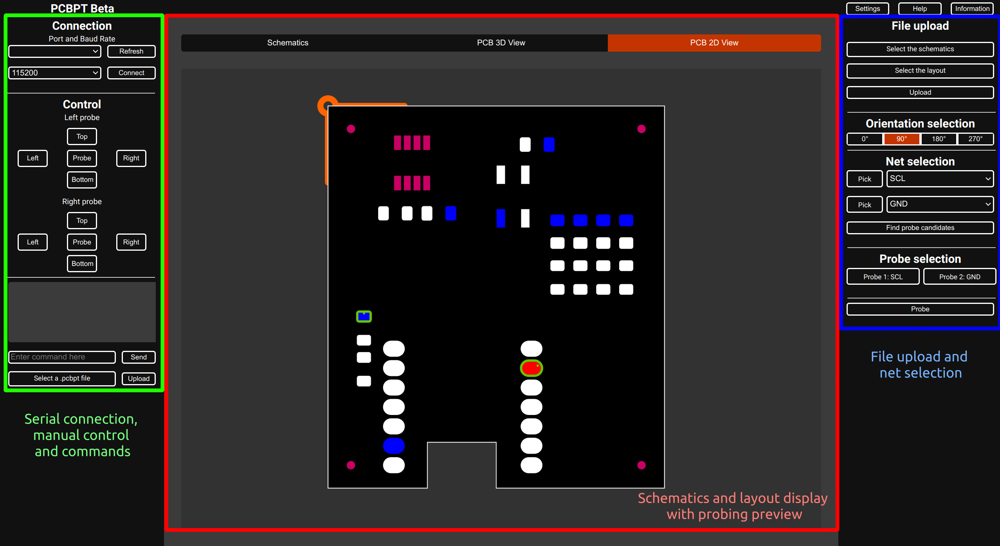

# PCBPT Interface

## Introduction

The PCBPT Interface is a web application that allows users to interact with the PCBPT system. It is built using the python [Flask](https://flask.palletsprojects.com/en/2.3.x/) framework and is designed to be run on a standalone raspberry pi. The interface is accessible via a web browser on any device connected to the same network as the raspberry pi (see [Usage](#usage) for more details).



### Features

Using the interface, users can:
- Connect to the probe tester
- Manually control the probe tester
- Send commands and view responses
- Upload a file containing a list of commands set to be executed sequentially
- Upload kKicad schematic and layout files
- Select the nets to be probed
- Manually select the pads to be probed
- Send a probe command to the probe tester

## Installation

Install the required python>=3.9 packages using pip:

```bash
pip install -r requirements.txt
```

## Usage

To run the interface, execute the following command:

```bash
python3 -m gunicorn --worker-class eventlet -w 1 interface:app --reload --bind :8001
```

You can modify the port number by changing the number after the colon in the `--bind` argument. The interface will be accessible at `http://<ip address>:<port number>`, where `<ip address>` is the IP address of the host machine running the interface (127.0.0.1 if on the same machine) and `<port number>` is the port number specified in the `--bind` argument.
